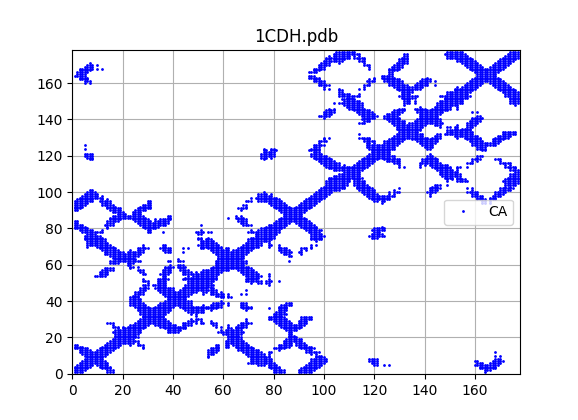
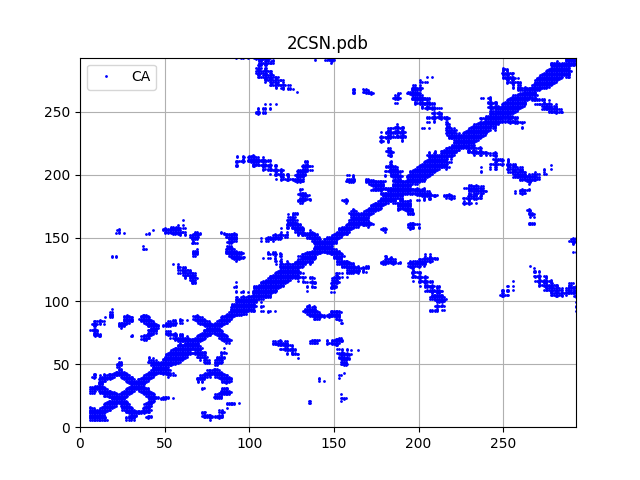
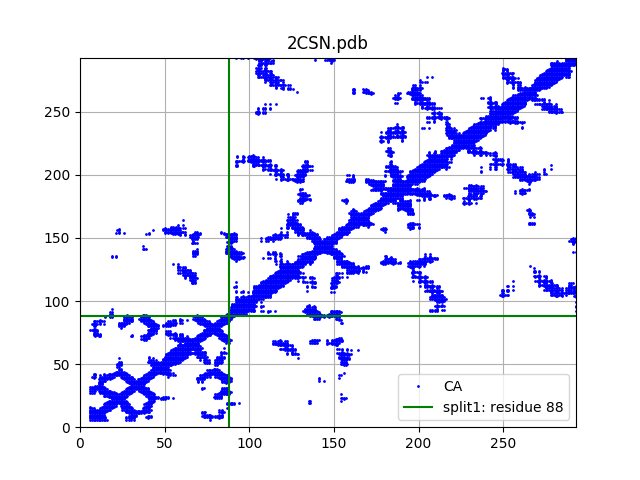
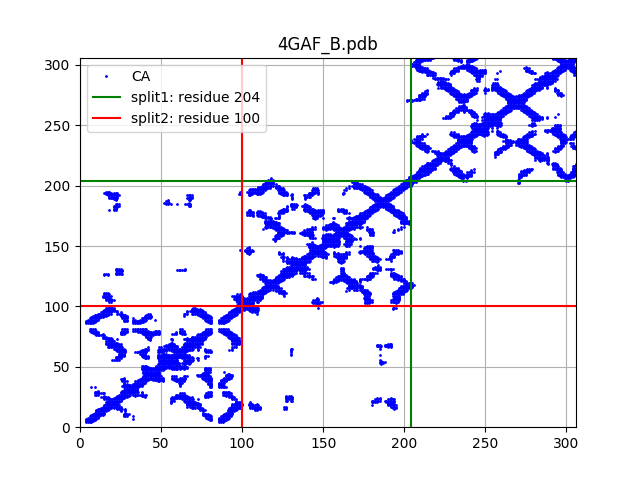
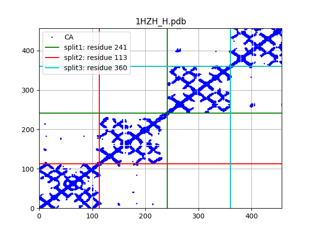

# Graph partitioning by residue (CA atoms)

Usage

```bash
python pdb-scanner.py 1CDH.pdb
python pdb-scanner.py 2CSN.pdb
python pdb-scanner.py 4GAF_B.pdb
python pdb-scanner.py 1HZH_H.pdb
```






